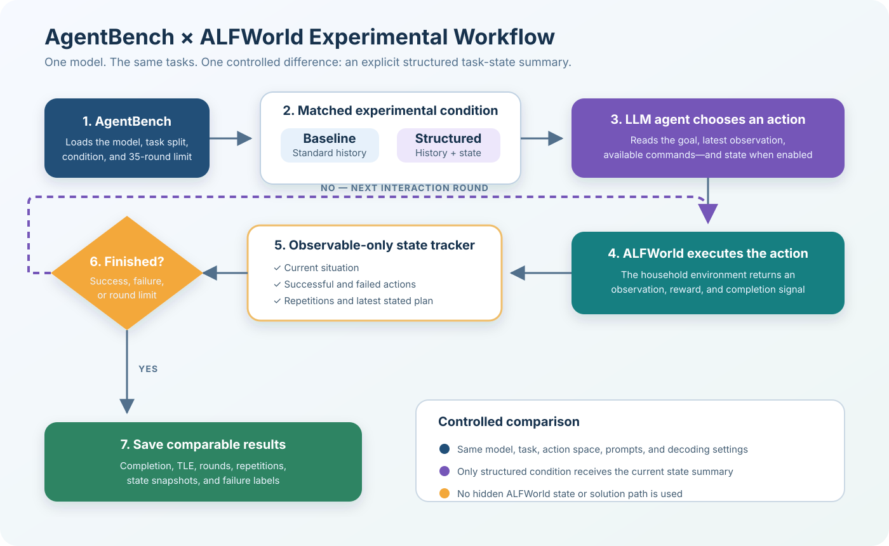

# AgentBench–ALFWorld Experiment Workflow



## Purpose

This workflow shows how the AgentBench extension connects an open-source LLM,
the ALFWorld House Holding environment, and the structured task-state tracker.
AgentBench remains the experiment coordinator. ALFWorld executes household
actions, while the state tracker records observable progress and supplies the
structured summary only in the experimental condition.

## Workflow components

### 1. AgentBench coordinator

The experiment begins with the AgentBench assigner. It loads the selected model,
the fixed task split, the maximum of 35 interaction rounds, and either the
baseline or structured-state condition.

Pilot command:

```bash
python -m src.assigner -c configs/assignments/alfworld_state_pilot.yaml
```

Full-study command:

```bash
python -m src.assigner -c configs/assignments/alfworld_state_experiment.yaml
```

### 2. Matched conditions

Both conditions use the same model, task files, prompt demonstrations, available
actions, decoding settings, and round limit.

- **Baseline:** the LLM receives AgentBench's standard conversation history.
- **Structured state:** the LLM also receives the current structured task-state
  summary.

This single controlled difference supports a direct comparison between the two
conditions.

### 3. LLM action selection

The LLM reads the goal, current ALFWorld observation, and admissible commands.
It returns an `ACTION:` line. The existing AgentBench action processor validates
and normalizes that response before execution.

### 4. ALFWorld execution

`src/server/tasks/alfworld/task.py` sends the selected command to ALFWorld. The
environment returns a new observation, completion status, and reward. The LLM
does not directly control the operating system or receive hidden simulator data.

### 5. State tracking

`src/server/tasks/alfworld/state_tracker.py` updates the following fields using
only the visible trajectory:

- Original goal
- Current observation
- Confirmed successful actions
- Failed actions
- Repeated and repeated-failed actions
- Latest plan extracted from the model's `THOUGHT:` text

In both conditions, this information is logged for later analysis. Only the
structured-state condition displays the rendered summary to the LLM. Previous
summaries are removed when the next one is supplied so stale state does not
accumulate in the history.

### 6. Termination decision

The interaction loop continues until one of the following occurs:

- ALFWorld reports successful task completion.
- The model produces an invalid format or action.
- The model reaches its context limit.
- A repeated-action loop is detected.
- The experiment reaches the 35-round task limit.

### 7. Result storage and comparison

AgentBench writes each trajectory to `runs.jsonl`. The additional experiment
record contains state snapshots, interaction rounds, repeated actions, repeated
failed actions, state-error labels, and failure types.

After both conditions finish, `analyze_results.py` produces:

- `comparison_summary.json`
- `task_level_results.csv`

These outputs compare completion rate, Task Limit Exceeded rate, average rounds,
repeated actions, and matched per-task improvements or regressions.

## Interpretation boundary

The tracker does not provide a correct solution or inspect ALFWorld's hidden
state. Its remaining-steps field contains the model's latest expressed plan,
not a ground-truth plan. Therefore, the experiment tests whether an explicit
record of the observable trajectory assists the agent; it does not establish
that the LLM possesses human memory or reasoning.
